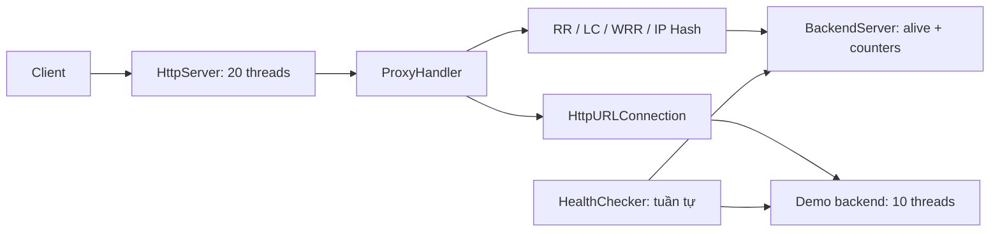

# Khảo sát trước khi sửa mã

Đã đọc toàn bộ 15 lớp Java, README, pom, cấu hình và hai script gốc.

## Giữ, sửa, xóa, thêm

| File / nhóm | Hành động và lý do |
|---|---|
| Main.java, util/AppLogger.java | Giữ điểm vào và logger nhỏ; bổ sung lifecycle khi cần. |
| config/ProxyConfig.java, ConfigLoader.java, application.properties | Viết lại cấu hình có kiểm tra giới hạn, Java 21, adaptive mặc định. |
| backend/BackendServer.java | Đổi thành định danh bất biến và capacity; trạng thái runtime chuyển sang module metrics. |
| loadbalancer/LoadBalancer.java, Factory, RoundRobin, LeastConnections | Giữ Strategy, sửa API để selection chạy dưới khóa điều phối; LC phá hòa công bằng. |
| WeightedRoundRobinLoadBalancer.java, IpHashLoadBalancer.java | Xóa: ngoài phạm vi ba thuật toán thí nghiệm; WRR còn lỗi cú pháp. |
| handler/ProxyHandler.java, server/ReverseProxyServer.java | Sửa chuyển tiếp, timeout, body limit, hop-by-hop headers, admission và shutdown. |
| healthcheck/HealthChecker.java | Thay health/metrics polling độc lập từng backend, timeout, xác nhận hồi phục. |
| backend/DemoBackendServer.java | Viết lại tải có capacity, CPU thật, memory telemetry, điều khiển chậm/chết/hồi phục. |
| pom.xml, scripts/*.sh, README.md | Sửa build Java 21, chạy có cleanup, hướng dẫn khớp hành vi thật. |
| metrics/BackendMetrics, loadbalancer/Dispatcher, AdaptiveLoadBalancer | Thêm EWMA, snapshot, select-and-reserve, release đúng một lần, slow start. |
| monitoring endpoint, test, benchmark, scripts PowerShell, docs | Thêm quan sát quyết định, kiểm tra đồng thời và thí nghiệm có số liệu. |

## Lỗi hiện tại

- Chọn backend rồi mới tăng counter: atomic counter riêng lẻ không khiến cả thao tác trở thành atomic.
- Health checker và lỗi request ghi đè alive; lỗi client cũng làm backend DOWN. Không warm-up, metric age hay cơ chế thăm dò lại backend chậm.
- Hàng đợi fixed thread pool và readAllBytes không có giới hạn; executor không shutdown.
- PATCH không được HttpURLConnection hỗ trợ; DELETE mất body; hop-by-hop headers bị sao chép sai; HEAD/204/304 xử lý sai; có thể gửi lỗi sau khi response đã bắt đầu.
- Backend /down chỉ đổi health, không làm request công việc thất bại. Chưa có phép đo tải hoặc benchmark.
- WRR chứa `BackendSe  rver`, không biên dịch được.

## Thiết kế điểm adaptive đề xuất

`scoreMs = latencyEWMA * (1 + (outstanding + 1) / effectiveCapacity) * resourcePenalty`

- `effectiveCapacity = configuredCapacity * warmup`, warmup tăng từ 0.1 đến 1 sau hồi phục.
- outstanding gồm request proxy đã giữ chỗ và ước lượng công việc ngoài proxy từ telemetry; không cộng hai lần toàn bộ active count.
- CPU chuẩn hóa [0,1]; phạt tăng khi gần bão hòa. Memory chỉ phạt vùng áp lực cao, không suy diễn RAM dùng nhiều luôn chậm. Error EWMA [0,1] làm tăng penalty. Các hệ số không có đơn vị; latency giữ đơn vị ms.
- Metric quá cũ được bỏ khỏi quyết định CPU/RAM/remote outstanding, có penalty bất định; vẫn dùng quan sát trực tiếp của proxy.
- Có thăm dò định kỳ giới hạn để học lại backend từng chậm. Giới hạn request đang xử lý và slow start áp dụng chung cho cả ba thuật toán.
- Đây là heuristic, không dự báo chính xác thời gian phục vụ hoặc biết trước độ nặng của từng URL. Hệ số cần được đánh giá bằng benchmark, không được kết luận adaptive luôn thắng.

Một ReentrantLock bảo vệ chọn + giữ chỗ, health transition và cập nhật metrics. Không giữ khóa khi làm I/O. Lease giải phóng đúng một lần kể cả timeout/ngắt client. Snapshot monitoring không lộ dữ liệu mutable.

## Xác minh

Build bằng javac --release 21; test thuật toán và các bất biến đồng thời; test HTTP thực, backend chết/hồi phục/chậm/tải CPU; benchmark homogeneous + heterogeneous + thay đổi tải với cùng seed/số request/concurrency. Lưu cả kết quả adaptive thua. Phân biệt CPU tiến trình, CPU host, heap JVM và RAM host trong báo cáo.

Tài liệu đối chiếu: [JDK 21 OperatingSystemMXBean](https://docs.oracle.com/en/java/javase/21/docs/api/jdk.management/com/sun/management/OperatingSystemMXBean.html), [Envoy slow start](https://www.envoyproxy.io/docs/envoy/latest/intro/arch_overview/upstream/load_balancing/slow_start). Thuật toán ở đây tự cài đặt, không dùng Envoy làm proxy.
